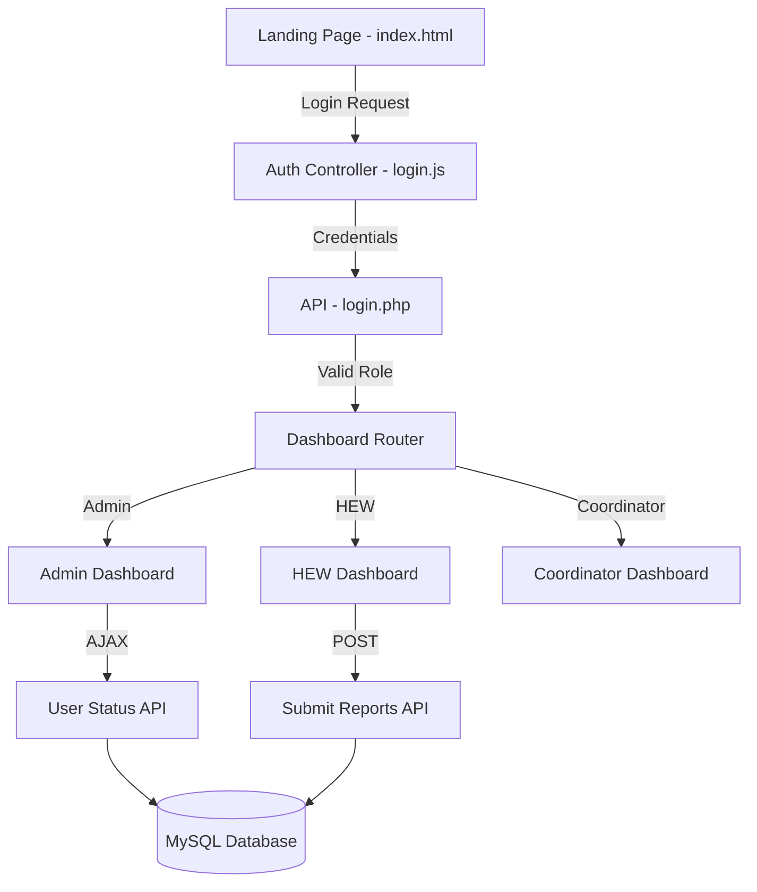

# D-HEIRS (Digital Health Extension Information Gathering & Reporting System)

## 📖 System Overview
D-HEIRS is a web-based platform designed to digitize the workflow of Health Extension Workers (HEWs), Coordinators, and Administrators in the Ethiopian healthcare system. The system facilitates household registration, health data entry, report submission, and administrative oversight.

---

## 🏗 System Architecture & Technical Breakdown

### 🔄 Information Architecture


### 💻 Tech Stack Deep Dive

#### 1. Backend: Native PHP
- **Why Native PHP?** High performance with minimal overhead, perfect for low-resource server environments.
- **Data Handling**: Uses PDO or Prepared Statements to prevent SQL injection.
- **Modularity**: Code is organized into `php/` (logic), `css/` (styling), and `js/` (interactivity).

#### 2. Frontend: Vanilla JS & Custom CSS
- **Asynchronous Updates**: Uses `fetch()` API and AJAX to update dashboard statistics (`dashboard_stats.php`) without full page reloads.
- **Responsive UI**: Custom CSS variables for a "Pro" look, ensuring it works on tablets and desktops used by health workers.

#### 3. Database: MySQL
- **Relational Integrity**: Foreign key constraints ensure that every report is mapped to a valid Kebele and User ID.
- **Auditability**: An `audit_logs` table records every critical action (`INSERT`, `UPDATE`, `DELETE`, `LOGIN`).

### 🛡 Security & Reliability
- **Role-Based Access Control (RBAC)**: Distinct views and capabilities for HEWs, Focal Persons, and Admins.
- **Session Management**: Secure PHP sessions with timeout and role validation on every page.
- **Input Validation**: Server-side filtering of all user-submitted data.

---

## 🚀 The System Journey
To understand D-HEIRS, one must follow the path of information:

1.  **Entrance (The Landing Page)**: Users arrive at [index.html](file:///d:/D-HEIRS/index.html) where the mission and vision are presented.
2.  **Gatekeeper (Authentication)**: Access is managed via a secure login. The system identifies the user's role (Admin, HEW, Coordinator).
3.  **Command Center (Dashboard)**: After login, the user is redirected to their specific functional area.
    *   **Admin**: Total control over users and system logs.
    *   **HEW**: Front-line data entry and household registration.
    *   **HMIS**: Statistical analysis and secondary reporting.

---

## 📂 File Structure & Architecture
The system follows a **modular architecture**, separating concerns by user role (Admin, HEW, Coordinator) and functionality (Authentication, API).

### **Visual Folder Structure**
```text
D-HEIRS/
├── admin/                 # Admin Dashboard & User Management
│   ├── css/               # Admin specific styles
│   ├── js/                # Admin interactive logic
│   └── php/               # Backend logic for admin features
├── HEW/                   # Health Extension Worker Module
│   ├── css/               # HEW specific styles
│   ├── images/            # Assets for HEW module
│   ├── js/                # HEW interactive logic
│   └── php/               # Backend logic for HEW features e.g., Household registration
├── focal/                 # Focal Person Module
│   ├── css/               # Focal specific styles
│   ├── js/                # Focal interactive logic
│   └── php/               # Backend logic for data validation & reporting
├── hmis/                  # HMIS Module
│   ├── css/               # HMIS specific styles
│   ├── js/                # HMIS interactive logic
│   └── php/               # Backend logic for report generation & DHIS2 submission
├── api/                   # Dedicated JSON API Endpoints
│   ├── dashboard_stats.php
│   ├── user_status.php
│   ├── search_users.php
│   ├── focal_person.php
│   └── hew_coordinator.php
├── authentication/        # Public Auth Pages (Forgot Password, etc.)
├── HEW-COORDNATOR/        # Health Extension Worker Coordinator Module
├── supervisor/            # Supervisor Module
├── css/                   # Global shared styles
├── js/                    # Global shared JavaScript
├── sql/                   # Database scripts & migration files
├── images/                # Global image assets
├── index.html             # Landing Page
├── login.php              # Central Authentication Controller
├── dataBaseConnection.php # Global Database Configuration
└── README.md              # Project Documentation
```

### **Module Breakdown**

#### **1. Admin Module (`/admin`)**
Handles system configuration, user management, and high-level reporting.
- `php/`: Contains server-side logic (e.g., `dashboard.php`, `user_management.php`, `audit_logs.php`).
- `js/`: Admin-specific JavaScript files (e.g., `dashboard.js` for real-time stats).
- `css/`: Admin styling (e.g., `admin.css`).
- **Key Features**: Create/Edit/Delete users, manage Kebeles, view system-wide audit logs.

#### **2. HEW Module (`/HEW`)**
The workspace for Health Extension Workers.
- `php/`: Core logic for HEWs (e.g., `hew_dashboard.php`, `register_household.php`, `submit_reports.php`).
- `js/`, `css/`: Module-specific assets.
- `images/`: Stores HEW module assets.
- **Key Features**: Register households, enter patient health data, submit weekly reports.

#### **3. Focal Person Module (`/focal`)**
The module for Focal Persons to validate and process HEW data.
- `php/`: Logic for report processing and data validation.
- `js/`, `css/`: Module-specific UI and interactions.
- **Key Features**: Data validation, report processing, coordination oversight.

#### **4. HMIS Module (`/hmis`)**
Dedicated module for Health Management Information System processing.
- `php/`: Core report generation logic (e.g., `hmis_dashboard.php`, `generate_reports.php`).
- `js/`, `css/`: Dashboard and UI components.
- **Key Features**: Process statistical packages, generate official reports, log DHIS2 submissions.

#### **5. API (`/api`)**
A dedicated folder for JSON-based endpoints used by JavaScript for asynchronous operations (AJAX).
- `dashboard_stats.php`: Returns JSON stats for dashboards.
- `user_status.php`: Handles status toggling (Active/Inactive).
- `search_users.php`: Backend for real-time user search variables.
- `reset_password.php`: Handles password reset logic.

#### **6. Coordinator Module (`/HEW-COORDNATOR`)**
The interface for HEW Coordinators to review and oversee health reports.
- **Key Features**: Review HEW reports, forward validated data, track community health trends.

#### **7. Supervisor Module (`/supervisor`)**
Provides oversight and support tools for system supervisors.
- **Key Features**: System monitoring, supervisor-level reporting, support management.

#### **8. Authentication (`/authentication`)**
Handles public-facing auth pages.
- `php/`: Files like `forgot_password.php`.
- `js/`: Logic for auth forms (`auth_logic.js`).
- `css/`: Styling for login/forgot password pages.

---

---

## 🔌 Database Connection
The system connects to a MySQL database named **`lichamba_database`**.

**File:** `dataBaseConnection.php`
- **Method**: Uses `mysqli` object-oriented interface.
- **Config**:
  - Server: `localhost`
  - User: `root`
  - Password: `""` (Empty by default for XAMPP/WAMP)
  - Charset: `utf8mb4` (Supports full Unicode).
- **Usage**: Included at the top of every PHP file that needs database access via `include "path/to/dataBaseConnection.php";`.

---

## 🔐 Authentication & Security
### **Login Flow**
1.  **Input**: User enters ID (e.g., `HEW-001`) or Email.
2.  **Processing**: `login.php` receives the POST request.
3.  **Validation**:
    *   Checks if input is Email or ID.
    *   Queries `users` table.
    *   Verifies password hash using `password_verify()`.
    *   Checks if status is `active`.
4.  **Session**: Starts a secure PHP session (`session_start()`) and stores:
    *   `$_SESSION['userId']`
    *   `$_SESSION['role']`
    *   `$_SESSION['user_db_id']`
5.  **Redirection**: JavaScript redirects the user based on their role:
    *   **Admin** -> `admin/php/dashboard.php`
    *   **HEW** -> `HEW/php/hew_dashboard.php`
    *   **Coordinator** -> `HEW-COORDNATOR/Review_HEW_Report.php`

### **Password Security**
- Passwords are **never** stored in plain text.
- The system uses PHP's `password_hash()` (Bcrypt) for storage and `password_verify()` for checking credentials.

---

## 📡 API & Data Fetching
The system uses two primary methods to fetch data:

### **1. Server-Side Rendering (PHP)**
For initial page loads, PHP directly queries the database and renders HTML.
**Example Code (`user_management.php`):**
```php
$sql = "SELECT * FROM users ORDER BY id DESC";
$result = $dataBaseConnection->query($sql);
while($row = $result->fetch_assoc()) {
    echo "<tr><td>" . $row['name'] . "</td></tr>";
}
```

### **2. Client-Side Fetching (AJAX/Fetch API)**
For interactive features (like search, status updates, or charts) without reloading the page.
**Example Code (`dashboard.js`):**
```javascript
fetch('../api/dashboard_stats.php')
  .then(response => response.json())
  .then(data => {
      document.getElementById('total-users').innerText = data.total;
  });
```

---

## 🛠 Setup & Installation
1.  **Database**:
    *   Import `sql/complete_database_setup.sql` into your MySQL server.
    *   Ensure the database name matches `lichamba_database`.
2.  **Server**:
    *   Place the project folder in `htdocs` (XAMPP) or `www` (WAMP).
    *   Start Apache and MySQL services.
3.  **Config**:
    *   Check credentials in `dataBaseConnection.php` if your local environment uses a database password.
4.  **Access**:
    *   Open browser and go to `http://localhost/D-HEIRS/`.

---

## 📊 HMIS Module Details
The HMIS module is the final stage of the health data pipeline. It takes validated data from Linkage Focal Persons and turns them into official policy-ready reports.

### **Core Capabilities**
- **Statistical Package Intake**: Automatically receives and displays packages sent from the community level.
- **Multi-Format Export**: Generates reports in professional PDF or Excel formats.
- **DHIS2 Integration**: Tracks and logs submissions to the national health database (DHIS2).
- **Trend Analytics**: Real-time dashboard stats for report timeliness and accuracy.

---

## 📝 Credits
**Developer**: [WCU 3rd Year Students 2025]
**Purpose**: Transforming Ethiopian Health Extension Program with digital tools.
